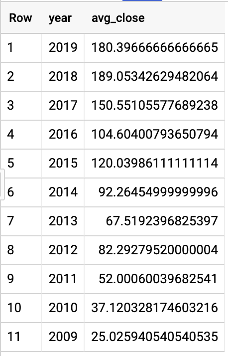

### Open BigQuery Console

In the Google Cloud Console, select **Navigation menu** > **BigQuery**:


The **Welcome to BigQuery in the Cloud Console** message box opens. This message box provides a link to the quickstart guide and lists UI updates.

Click **Done**.

The BigQuery console opens.


## Load Data from Google Cloud Storage into BigQuery

1. In the BigQuery navigation menu on the left-hand side select your project id.
2. On the right side click on **CREATE DATASET**.
3. In the menu that results, enter the following values and then click **Create dataset**:

- **Dataset ID**: `ai4f`
- **Default table expiration**: Never
- **Encryption**: Google-managed key

1. Once the dataset is created it will be listed in the navigation menu under your project id. Click on `ai4f`.
2. On the right side click on **CREATE TABLE**.
3. In the menu that results, enter the following values and then click **Create table** (items not specified should be left at their defaults):

- **Create table from**: Google Cloud Storage
- **Select file from GCS bucket**: `cloud-training/ai4f/AAPL10Y.csv`
- **Table name**: AAPL10Y
- **Auto detect**: Schema and input parameters

1. You can view the table's schema by selecting it from the left-hand menu and clicking on the **Schema** tab.

## Explore the AAPL Data

### Question: What are the minimum and maximum dates present in the dataset?

1. Copy and paste the following SQL code into the Query Editor:

```sql
SELECT
  MIN(date) AS min_date,
  MAX(date) AS max_date
FROM
  `ai4f.AAPL10Y`content_copy
```

1. Click on **Run**. You should receive the following result:


### Question: What's the average closing share price for each year?

1. Click on **COMPOSE NEW QUERY**. Copy and paste the following SQL code into the Query Editor:

```sql
SELECT
  EXTRACT(year FROM date) AS year,
  AVG(close) AS avg_close
FROM
  `ai4f.AAPL10Y`
GROUP BY
  year
ORDER BY
  year DESCcontent_copy
```

1. Click on **Run**. You should receive the following result:



### Question: Which five dates correspond to the greatest percent increases in AAPL stock?

1. Click on **COMPOSE NEW QUERY**. Copy and paste the following SQL code into the Query Editor:

```sql
SELECT
  date,
  100.0 * close / LAG(close, 1) OVER(ORDER BY date) AS pct_close_change
FROM
  `ai4f.AAPL10Y`
ORDER BY
  pct_close_change DESC
LIMIT
  5content_copy
```

1. Click on **Run**. You should receive the following result:


What does the BigQuery LAG function do?

Identifies the percentile a given row falls into within a partition

Returns the value of an expression on a subsequent row

Returns the value of an expression on a preceding row

Assigns a rank to each row within a partition of a result set

Submit


## Build a Linear Regression Model in BigQuery

You will now create a linear regression model in BigQuery to predict the closing price of AAPL stock on any given day. The model will be very simple for the purposes of demonstrating BQML functionality. The only features we'll use as input into the model are the previous day's closing price and a three day trend value. The trend value can only take on two values, either -1 or +1. If the AAPL stock price has increased over any two of the previous three days then the trend will be +1. Otherwise, the trend value will be -1.

1. First, we'll need to generate a table that contains the features to create our regression model. Click on **COMPOSE NEW QUERY**.
2. Copy and paste the following query into the editor window:

```sql
WITH
  raw AS (
  SELECT
    date,
    close,
    LAG(close, 1) OVER(ORDER BY date) AS min_1_close,
    LAG(close, 2) OVER(ORDER BY date) AS min_2_close,
    LAG(close, 3) OVER(ORDER BY date) AS min_3_close,
    LAG(close, 4) OVER(ORDER BY date) AS min_4_close
  FROM
    `ai4f.AAPL10Y`
  ORDER BY
    date DESC ),
  raw_plus_trend AS (
  SELECT
    date,
    close,
    min_1_close,
    IF (min_1_close - min_2_close > 0, 1, -1) AS min_1_trend,
    IF (min_2_close - min_3_close > 0, 1, -1) AS min_2_trend,
    IF (min_3_close - min_4_close > 0, 1, -1) AS min_3_trend
  FROM
    raw ),
  ml_data AS (
  SELECT
    date,
    close,
    min_1_close AS day_prev_close,
    IF (min_1_trend + min_2_trend + min_3_trend > 0, 1, -1) AS trend_3_day
  FROM
    raw_plus_trend )
SELECT
  *
FROM
  ml_datacontent_copy
```

1. Instead of clicking on **Run**, select the **More** tab then click **Query settings**. In the menu leave all defaults except for the following:

- Select **Set a destination table for query results**.
- **Table name**: model_data

1. Click on **Save**.
2. Run the query by clicking on **Run**.
3. Click on **COMPOSE NEW QUERY**.
4. To build a regression model on the data stored in the table `model_data` execute the following query:

```sql
CREATE OR REPLACE MODEL `ai4f.aapl_model`
OPTIONS
  ( model_type='linear_reg',
    input_label_cols=['close'],
    data_split_method='seq',
    data_split_eval_fraction=0.3,
    data_split_col='date') AS
SELECT
  date,
  close,
  day_prev_close,
  trend_3_day
FROM
  `ai4f.model_data`content_copy
```

Note, this query saves the model into your dataset `ai4f`. The model will be listed along with the tables as `aapl_model`. To evaluate the performance of the model, a sequential split was used in this case, as is common for data with a time element. The split fraction is .3 and split uses the `date` column as the basis for the split.


The past 4 values of a stock's closing price are sequentially 80, 81, 74, and 77. What is the trend_3_day value?

+1

-1

Submit


## Evaluate Regression Model Performance

For linear regression models you want to use a loss metric like [Root Mean Square Error](https://en.wikipedia.org/wiki/Root-mean-square_deviation) (RMSE). You want to keep training and improving the model until it has the lowest RMSE while not overfitting.

Note, in BQML, mean_squared_error is a queryable field when evaluating your trained ML model. Add a SQRT() to get RMSE.

1. Click on **COMPOSE NEW QUERY**.
2. To obtain evaluation metrics execute the following query in the editor window:

```sql
SELECT * FROM ML.EVALUATE(MODEL `ai4f.aapl_model`)content_copy
```

Note, the split evaluation data is used to compute the evaluation metrics. Your results should look something like this:


Your model RMSE value will vary slightly.

## Make Predictions Using Model

1. Click on **COMPOSE NEW QUERY**. To make predictions using your trained model enter the following query in the editor window:

```sql
SELECT
  *
FROM
  ml.PREDICT(MODEL `ai4f.aapl_model`,
    (
    SELECT
      *
    FROM
      `ai4f.model_data`
    WHERE
      date >= '2019-01-01') )content_copy
```

This query will generate a new column called `predicted_close` containing the model's predictions for the closing price for all entries in the year 2019.

1. Click on **Run**. Your results should look similar to the following:

