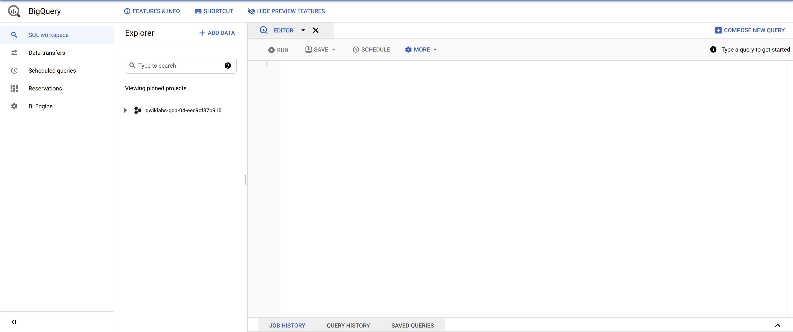
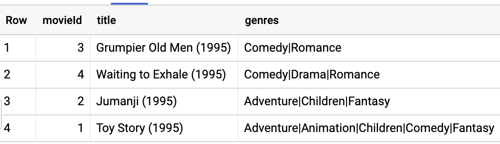
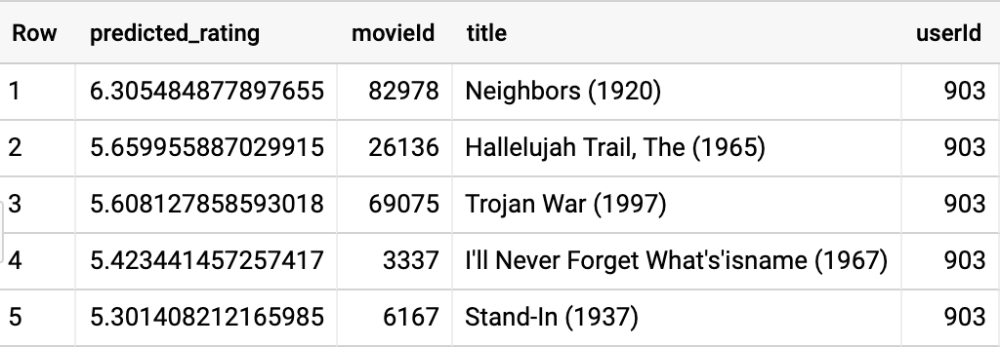
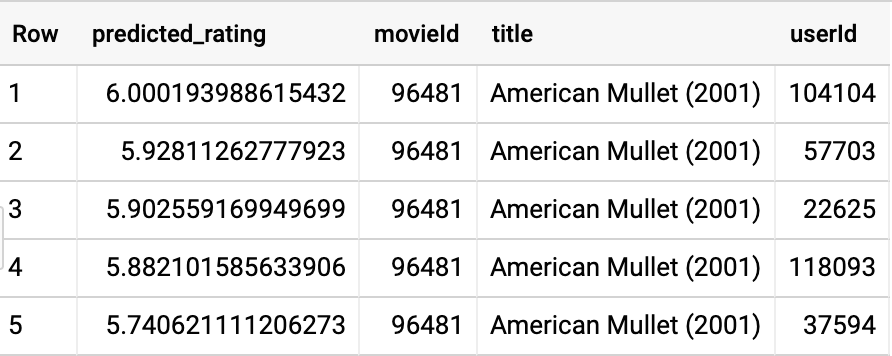

### Open BigQuery Console

In the Google Cloud Console, select **Navigation menu** > **BigQuery**:


The **Welcome to BigQuery in the Cloud Console** message box opens. This message box provides a link to the quickstart guide and lists UI updates.

Click **Done**.

The BigQuery console opens.



## Task 1: Get MovieLens data

In this task you will use the command line to create a BigQuery dataset to store the MovieLens data. The MovieLens data will then be loaded from a Cloud Storage bucket into the dataset.

### **Start the Cloud Shell Editor**

To create a BigQuery dataset and load the MovieLens data the Cloud Shell is used.

1. In the GCP Console, click **Activate Cloud Shell** ().
2. If prompted, click **Continue**.

### **Create and Load BigQuery Dataset**

1. Run the following command to create a BigQuery dataset named `movies`:

```bash
bq --location=EU mk --dataset movies
content_copy
```

1. Run the following commands separately in the Cloud Shell:

```bash
 bq load --source_format=CSV \
 --location=EU \
 --autodetect movies.movielens_ratings \
 gs://dataeng-movielens/ratings.csv
content_copy
 bq load --source_format=CSV \
 --location=EU   \
 --autodetect movies.movielens_movies_raw \
 gs://dataeng-movielens/movies.csv
content_copy
```


Get MovieLens Data


## Task 2: Explore the data

In this task you will explore and verify the MovieLens dataset using Query editor.

1. In BigQuery's **Query editor** execute the following query:

```SQL
SELECT
  COUNT(DISTINCT userId) numUsers,
  COUNT(DISTINCT movieId) numMovies,
  COUNT(*) totalRatings
FROM
  movies.movielens_ratingscontent_copy
```

You should confirm that the dataset consists of over 138 thousand users, nearly 27 thousand movies, and a little more than 20 million ratings.

1. Examine the first few movies using the query:

```SQL
SELECT
  *
FROM
  movies.movielens_movies_raw
WHERE
  movieId < 5content_copy
```



1. You can see that the genres column is a formatted string. Parse the genres into an array and rewrite the results into a table named `movielens_movies`.

```SQL
CREATE OR REPLACE TABLE
  movies.movielens_movies AS
SELECT
  * REPLACE(SPLIT(genres, "|") AS genres)
FROM
  movies.movielens_movies_rawcontent_copy
```

Feel free to perform additional queries until you are comfortable with the dataset.


Explore the Data


## Task 3: Evaluate a trained model created using collaborative filtering

In this task you will view the metrics for a trained model which was generated using matrix factorization.

Matrix factorization is a collaborative filtering technique that relies on two vectors called the user factors and the item factors. The user factors is a low-dimensional representation of a `user_id` and the item factors similarly represents an `item_id`.

To perform a matrix factorization of our data, you use the typical BigQuery ML syntax except that the `model_type` is `matrix_factorization` and you have to identify which columns play what roles in the collaborative filtering setup.

In order to apply matrix factorization to the movie ratings data, the BigQuery ML query needs to be executed to create the model. However, creation of this model type can take up to 40 minutes and requires a Google Cloud project with reservation-oriented resources -- which is unlike those offered by the Qwiklabs environment.

A model has been created in the Cloud Training project's **cloud-training-prod-bucket** BigQuery dataset for use in the rest of the lab.

**NOTE:** The query below is for reference only. Please **DO NOT EXECUTE** this query in your project.

CREATE OR REPLACE MODEL movies.movie_recommender

OPTIONS (model_type='matrix_factorization', user_col='userId', item_col='movieId', rating_col='rating', l2_reg=0.2, num_factors=16) AS

SELECT userId, movieId, rating

FROM movies.movielens_ratings

Note, the `num_factors` and `l2_reg` options have been selected after much experimentation to speed up training of the model.

1. To view metrics for the trained model, run the following query:

```SQL
SELECT * FROM ML.EVALUATE(MODEL `cloud-training-prod-bucket.movies.movie_recommender`)content_copy
```

## Task 4: Make Recommendations

In this task you will use the trained model to provide recommendations.

1. Let’s find the best comedy movies to recommend to the user whose `userId` is 903. Enter the query below:

```SQL
SELECT
  *
FROM
  ML.PREDICT(MODEL `cloud-training-prod-bucket.movies.movie_recommender`,
    (
    SELECT
      movieId,
      title,
      903 AS userId
    FROM
      `movies.movielens_movies`,
      UNNEST(genres) g
    WHERE
      g = 'Comedy' ))
ORDER BY
  predicted_rating DESC
LIMIT
  5  content_copy
```



1. This result includes movies the user has already seen and rated in the past. Let’s remove them:

```sql
SELECT
  *
FROM
  ML.PREDICT(MODEL `cloud-training-prod-bucket.movies.movie_recommender`,
    (
    WITH
      seen AS (
      SELECT
        ARRAY_AGG(movieId) AS movies
      FROM
        movies.movielens_ratings
      WHERE
        userId = 903 )
    SELECT
      movieId,
      title,
      903 AS userId
    FROM
      movies.movielens_movies,
      UNNEST(genres) g,
      seen
    WHERE
      g = 'Comedy'
      AND movieId NOT IN UNNEST(seen.movies) ))
ORDER BY
  predicted_rating DESC
LIMIT
  5content_copy
```

For this user, this happens to yield the same set of movies -- the top predicted ratings didn’t include any of the movies the user has already seen.


Making Recommendations


## Task 5:Apply customer targeting

In this task you will look at how to identify the top-rated movies for a specific user. Sometimes, you have a product and have to find the customers who are likely to appreciate it.

1. You wish to get more reviews for `movieId=96481` which has only one rating and you wish to send coupons to the 100 users who are likely to rate it the highest. Identify those users using:

```SQL
SELECT
  *
FROM
  ML.PREDICT(MODEL `cloud-training-prod-bucket.movies.movie_recommender`,
    (
    WITH
      allUsers AS (
      SELECT
        DISTINCT userId
      FROM
        movies.movielens_ratings )
    SELECT
      96481 AS movieId,
      (
      SELECT
        title
      FROM
        movies.movielens_movies
      WHERE
        movieId=96481) title,
      userId
    FROM
      allUsers ))
ORDER BY
  predicted_rating DESC
LIMIT
  100content_copy
```

The result gives us 100 users to target, the top 5 of whom are:




## Task 6: Perform Batch predictions for all users and movies

In this task you will perform a query to obtain batch predictions for users and movies.

What if you wish to carry out predictions for every user and movie combination? Instead of having to pull distinct users and movies as in the previous query, a convenience function is provided to carry out batch predictions for all `movieId` and `userId` encountered during training.

1. Enter the following query to obtain batch predictions:

```SQL
SELECT
  *
FROM
  ML.RECOMMEND(MODEL `cloud-training-prod-bucket.movies.movie_recommender`)
LIMIT 
  100000content_copy
```

Without the LIMIT command the results would be too large to return given the default settings. But the output provides you a sense of the type of predictions that can be made with this model.

As seen in a section above, it is possible to filter out movies the user has already seen and rated in the past. The reason already seen movies aren’t filtered out by default is that there are situations (think of restaurant recommendations, for example) where it is perfectly expected that you would need to recommend restaurants the user has liked in the past.