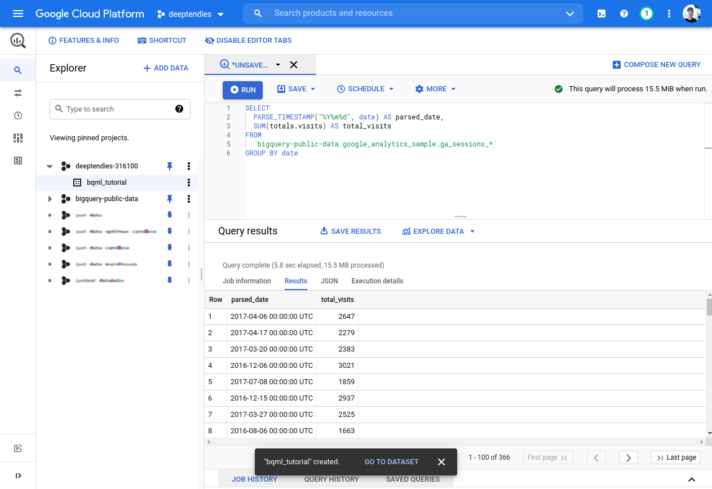
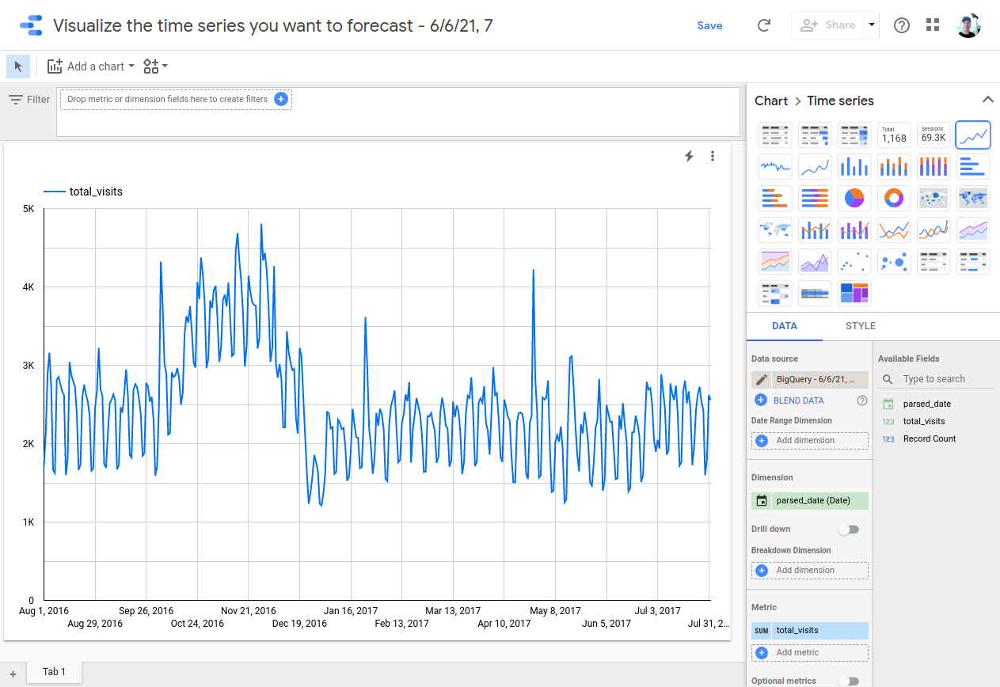
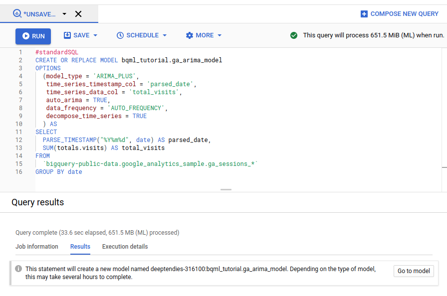
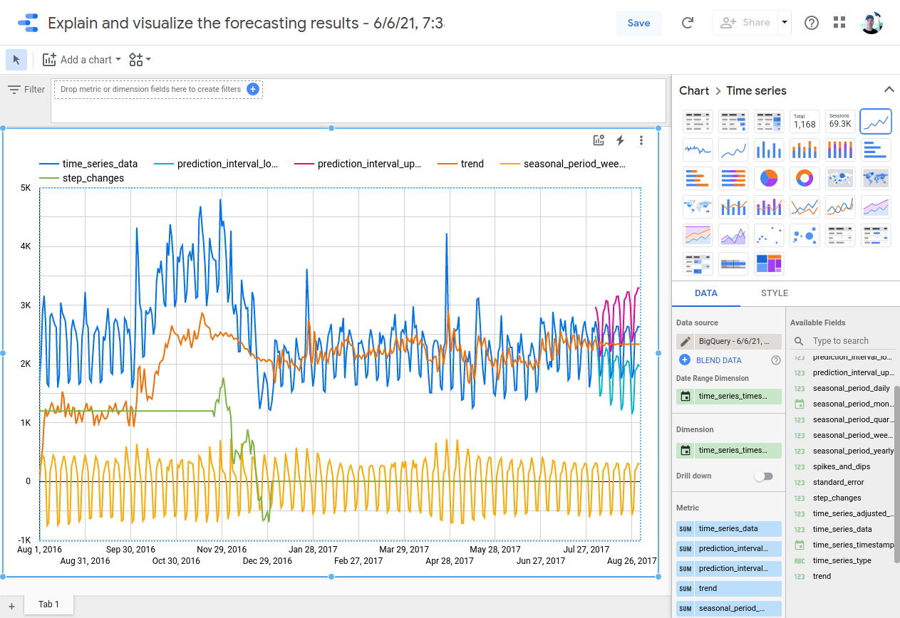

Tutorial URL: https://cloud.google.com/bigquery-ml/docs/arima-single-time-series-forecasting-tutorial

# Step one: Create your dataset

https://cloud.google.com/bigquery-ml/docs/arima-single-time-series-forecasting-tutorial#step_one_create_your_dataset


# Step two: Visualize the time series you want to forecast

https://cloud.google.com/bigquery-ml/docs/arima-single-time-series-forecasting-tutorial#optional_step_two_visualize_the_time_series_you_want_to_forecast

```sql
#standardSQL
SELECT
  PARSE_TIMESTAMP("%Y%m%d", date) AS parsed_date,
  SUM(totals.visits) AS total_visits
FROM
  `bigquery-public-data.google_analytics_sample.ga_sessions_*`
GROUP BY date
```






# Step three: Create your time series model

https://cloud.google.com/bigquery-ml/docs/arima-single-time-series-forecasting-tutorial#time-series-model

```sql
#standardSQL
CREATE OR REPLACE MODEL bqml_tutorial.ga_arima_model
OPTIONS
  (model_type = 'ARIMA_PLUS',
   time_series_timestamp_col = 'parsed_date',
   time_series_data_col = 'total_visits',
   auto_arima = TRUE,
   data_frequency = 'AUTO_FREQUENCY',
   decompose_time_series = TRUE
  ) AS
SELECT
  PARSE_TIMESTAMP("%Y%m%d", date) AS parsed_date,
  SUM(totals.visits) AS total_visits
FROM
  `bigquery-public-data.google_analytics_sample.ga_sessions_*`
GROUP BY date
```



# Step four: Inspect the evaluation metrics of all evaluated models

https://cloud.google.com/bigquery-ml/docs/arima-single-time-series-forecasting-tutorial#step_four_inspect_the_evaluation_metrics_of_all_evaluated_models

```sql
#standardSQL
SELECT
 *
FROM
 ML.ARIMA_EVALUATE(MODEL bqml_tutorial.ga_arima_model)
```

| Row  | non_seasonal_p | non_seasonal_d | non_seasonal_q | has_drift | log_likelihood      | AIC                | variance           | seasonal_periods | has_holiday_effect | has_spikes_and_dips | has_step_changes | error_message |      |
| :--- | :------------- | :------------- | :------------- | :-------- | :------------------ | :----------------- | :----------------- | :--------------- | :----------------- | :------------------ | :--------------- | :------------ | :--- |
| 1    | 2              | 1              | 3              | false     | -2438.086897308905  | 4888.17379461781   | 36768.58098974534  | WEEKLY           | false              | false               | true             |               |      |
| 2    | 3              | 1              | 2              | false     | -2452.1162482332147 | 4916.232496466429  | 39837.617201457666 | WEEKLY           | false              | false               | true             |               |      |
| 3    | 2              | 1              | 3              | true      | -2451.766265504015  | 4917.53253100803   | 39762.149912707384 | WEEKLY           | false              | false               | true             |               |      |
| 4    | 3              | 1              | 2              | true      | -2451.9420237604018 | 4917.8840475208035 | 39799.888320973696 | WEEKLY           | false              | false               | true             |               |      |
| 5    | 1              | 1              | 1              | false     | -2464.0376305285413 | 4934.075261057083  | 42722.334200958394 | WEEKLY           | false              | false               | true             |               |      |
| 6    | 1              | 1              | 1              | true      | -2463.376735247451  | 4934.753470494902  | 42565.031356711035 | WEEKLY           | false              | false               | true             |               |      |
| 7    | 1              | 1              | 2              | false     | -2463.9203701441857 | 4935.840740288371  | 42695.14063545563  | WEEKLY           | false              | false               | true             |               |      |
| 8    | 2              | 1              | 1              | false     | -2463.9391506408683 | 4935.878301281737  | 42699.409534261154 | WEEKLY           | false              | false               | true             |               |      |
| 9    | 1              | 1              | 2              | true      | -2463.226340257114  | 4936.452680514228  | 42530.249857568815 | WEEKLY           | false              | false               | true             |               |      |
| 10   | 2              | 1              | 1              | true      | -2463.2491520451795 | 4936.498304090359  | 42535.416132224454 | WEEKLY           | false              | false               | true             |               |      |
| 11   | 0              | 1              | 3              | false     | -2464.321303972917  | 4936.642607945834  | 42790.81109762309  | WEEKLY           | false              | false               | true             |               |      |
| 12   | 1              | 1              | 3              | false     | -2463.698731062249  | 4937.397462124498  | 42644.60646330074  | WEEKLY           | false              | false               | true             |               |      |
| 13   | 0              | 1              | 3              | true      | -2463.743534138774  | 4937.487068277548  | 42653.01927893553  | WEEKLY           | false              | false               | true             |               |      |
| 14   | 0              | 1              | 2              | false     | -2465.770944352638  | 4937.541888705276  | 43141.102777422646 | WEEKLY           | false              | false               | true             |               |      |
| 15   | 3              | 1              | 1              | false     | -2463.85332092433   | 4937.70664184866   | 42679.810140640635 | WEEKLY           | false              | false               | true             |               |      |
| 16   | 2              | 1              | 2              | false     | -2463.9579312715646 | 4937.915862543129  | 42703.688763711696 | WEEKLY           | false              | false               | true             |               |      |
| 17   | 1              | 1              | 3              | true      | -2462.9840163057643 | 4937.9680326115285 | 42475.09148291258  | WEEKLY           | false              | false               | true             |               |      |
| 18   | 3              | 1              | 1              | true      | -2463.1470762874624 | 4938.294152574925  | 42512.13961427258  | WEEKLY           | false              | false               | true             |               |      |
| 19   | 0              | 1              | 4              | false     | -2464.1846767792867 | 4938.3693535585735 | 42757.19016974629  | WEEKLY           | false              | false               | true             |               |      |
| 20   | 2              | 1              | 2              | true      | -2463.2757702103863 | 4938.551540420773  | 42541.47543904129  | WEEKLY           | false              | false               | true             |               |      |
| 21   | 0              | 1              | 2              | true      | -2465.3298788921097 | 4938.659757784219  | 43035.62262857535  | WEEKLY           | false              | false               | true             |               |      |
| 22   | 0              | 1              | 4              | true      | -2463.5660320342668 | 4939.1320640685335 | 42609.717438729625 | WEEKLY           | false              | false               | true             |               |      |
| 23   | 1              | 1              | 4              | false     | -2463.643474004146  | 4939.286948008292  | 42631.51329924699  | WEEKLY           | false              | false               | true             |               |      |
| 24   | 0              | 1              | 5              | false     | -2463.724853741763  | 4939.449707483526  | 42637.18451561334  | WEEKLY           | false              | false               | true             |               |      |
| 25   | 4              | 1              | 0              | false     | -2464.952651488576  | 4939.905302977152  | 42952.65869266617  | WEEKLY           | false              | false               | true             |               |      |
| 26   | 1              | 1              | 4              | true      | -2462.9697905251933 | 4939.939581050387  | 42471.69395548561  | WEEKLY           | false              | false               | true             |               |      |
| 27   | 0              | 1              | 5              | true      | -2463.15327922789   | 4940.30655845578   | 42501.899781870554 | WEEKLY           | false              | false               | true             |               |      |
| 28   | 5              | 1              | 0              | false     | -2464.343825984989  | 4940.687651969978  | 42807.67299682759  | WEEKLY           | false              | false               | true             |               |      |
| 29   | 4              | 1              | 0              | true      | -2464.6212250891695 | 4941.242450178339  | 42874.411685056795 | WEEKLY           | false              | false               | true             |               |      |
| 30   | 4              | 1              | 1              | false     | -2464.8149048559258 | 4941.6298097118515 | 42919.87924572697  | WEEKLY           | false              | false               | true             |               |      |
| 31   | 3              | 1              | 0              | false     | -2466.955001089993  | 4941.910002179986  | 43432.405324051135 | WEEKLY           | false              | false               | true             |               |      |
| 32   | 5              | 1              | 0              | true      | -2464.035985176658  | 4942.071970353316  | 42735.28945803389  | WEEKLY           | false              | false               | true             |               |      |
| 33   | 4              | 1              | 1              | true      | -2464.509736852833  | 4943.019473705666  | 42847.84669416562  | WEEKLY           | false              | false               | true             |               |      |
| 34   | 3              | 1              | 0              | true      | -2466.667337487466  | 4943.334674974932  | 43363.79207742147  | WEEKLY           | false              | false               | true             |               |      |
| 35   | 0              | 1              | 1              | false     | -2470.741473437104  | 4945.482946874208  | 44347.18232054797  | WEEKLY           | false              | false               | true             |               |      |
| 36   | 0              | 1              | 1              | true      | -2470.4385757349664 | 4946.877151469933  | 44273.25297038863  | WEEKLY           | false              | false               | true             |               |      |
| 37   | 2              | 1              | 0              | false     | -2472.8992022722823 | 4951.798404544565  | 44883.4777009301   | WEEKLY           | false              | false               | true             |               |      |
| 38   | 2              | 1              | 0              | true      | -2472.6665625621536 | 4953.333125124307  | 44826.18293821439  | WEEKLY           | false              | false               | true             |               |      |
| 39   | 1              | 1              | 0              | false     | -2479.6213498568186 | 4963.242699713637  | 46577.33708629871  | WEEKLY           | false              | false               | true             |               |      |
| 40   | 1              | 1              | 0              | true      | -2479.4437602614707 | 4964.8875205229415 | 46531.98521459657  | WEEKLY           | false              | false               | true             |               |      |
| 41   | 0              | 1              | 0              | false     | -2494.220696898044  | 4990.441393796088  | 50467.54100935712  | WEEKLY           | false              | false               | true             |               |      |
| 42   | 0              | 1              | 0              | true      | -2494.1156812652143 | 4992.231362530429  | 50438.508920597415 | WEEKLY           | false              | false               | true             |               |      |

# Step five: Inspect the coefficients of your model

https://cloud.google.com/bigquery-ml/docs/arima-single-time-series-forecasting-tutorial#step_five_inspect_the_coefficients_of_your_model

| Row  | ar_coefficients | ma_coefficients     | intercept_or_drift |      |
| :--- | :-------------- | :------------------ | :----------------- | :--- |
| 1    |                 | -0.2515010229632323 | 0.0                |      |
|      |                 | 0.7211077786144022  |                    |      |
|      |                 | -0.6235214362668877 |                    |      |

# Step six: Use your model to forecast the time series

https://cloud.google.com/bigquery-ml/docs/arima-single-time-series-forecasting-tutorial#step_six_use_your_model_to_forecast_the_time_series

```sql
#standardSQL
SELECT
 *
FROM
 ML.FORECAST(MODEL bqml_tutorial.ga_arima_model,
             STRUCT(30 AS horizon, 0.8 AS confidence_level))
```

to change the confidence level to 0.95 for example

```sql
#standardSQL
SELECT
 *
FROM
 ML.FORECAST(MODEL bqml_tutorial.ga_arima_model,
             STRUCT(30 AS horizon, 0.95 AS confidence_level))
```

| Row  | forecast_timestamp      | forecast_value     | standard_error     | confidence_level | prediction_interval_lower_bound | prediction_interval_upper_bound | confidence_interval_lower_bound | confidence_interval_upper_bound |      |
| :--- | :---------------------- | :----------------- | :----------------- | :--------------- | :------------------------------ | :------------------------------ | :------------------------------ | :------------------------------ | :--- |
| 1    | 2017-08-02 00:00:00 UTC | 2724.1940691734862 | 191.75146494897575 | 0.95             | 2349.0403639718616              | 3099.347774375111               | 2349.0403639718616              | 3099.347774375111               |      |
| 2    | 2017-08-03 00:00:00 UTC | 2593.606751803373  | 224.8219107310186  | 0.95             | 2153.7521053541586              | 3033.461398252587               | 2153.7521053541586              | 3033.461398252587               |      |
| 3    | 2017-08-04 00:00:00 UTC | 2353.5021699824856 | 257.7841209556438  | 0.95             | 1849.1583406178058              | 2857.845999347165               | 1849.1583406178058              | 2857.845999347165               |      |
| 4    | 2017-08-05 00:00:00 UTC | 1783.6681803409047 | 264.57205063818935 | 0.95             | 1266.0440510226747              | 2301.292309659135               | 1266.0440510226747              | 2301.292309659135               |      |
| 5    | 2017-08-06 00:00:00 UTC | 1879.7261445333145 | 271.79692850258505 | 0.95             | 1347.9668444554845              | 2411.4854446111444              | 1347.9668444554845              | 2411.4854446111444              |      |
| 6    | 2017-08-07 00:00:00 UTC | 2490.742255315815  | 293.3539490997711  | 0.95             | 1916.807547856904               | 3064.676962774726               | 1916.807547856904               | 3064.676962774726               |      |
| 7    | 2017-08-08 00:00:00 UTC | 2539.6908198175597 | 310.5291870987961  | 0.95             | 1932.1534789979673              | 3147.228160637152               | 1932.1534789979673              | 3147.228160637152               |      |
| 8    | 2017-08-09 00:00:00 UTC | 2669.530619893514  | 317.8774313762421  | 0.95             | 2047.616747097261               | 3291.4444926897672              | 2047.616747097261               | 3291.4444926897672              |      |
| 9    | 2017-08-10 00:00:00 UTC | 2639.452952302257  | 327.49686786518726 | 0.95             | 1998.7190551492681              | 3280.186849455246               | 1998.7190551492681              | 3280.186849455246               |      |
| 10   | 2017-08-11 00:00:00 UTC | 2383.479378837878  | 343.01242344522996 | 0.95             | 1712.3899474225375              | 3054.5688102532185              | 1712.3899474225375              | 3054.5688102532185              |      |
| 11   | 2017-08-12 00:00:00 UTC | 1747.6953802824523 | 354.86218462028063 | 0.95             | 1053.422387731047               | 2441.9683728338578              | 1053.422387731047               | 2441.9683728338578              |      |
| 12   | 2017-08-13 00:00:00 UTC | 1866.315896385996  | 362.8141720546334  | 0.95             | 1156.4851736732694              | 2576.1466190987226              | 1156.4851736732694              | 2576.1466190987226              |      |
| 13   | 2017-08-14 00:00:00 UTC | 2521.9784858701237 | 372.7981030761716  | 0.95             | 1792.614620522976               | 3251.3423512172712              | 1792.614620522976               | 3251.3423512172712              |      |
| 14   | 2017-08-15 00:00:00 UTC | 2547.0932668603227 | 384.8422952739379  | 0.95             | 1794.1654442294334              | 3300.021089491212               | 1794.1654442294334              | 3300.021089491212               |      |
| 15   | 2017-08-16 00:00:00 UTC | 2643.3086599182393 | 394.50724939269287 | 0.95             | 1871.4717595954562              | 3415.1455602410224              | 1871.4717595954562              | 3415.1455602410224              |      |
| 16   | 2017-08-17 00:00:00 UTC | 2634.389822249994  | 402.7013619424083  | 0.95             | 1846.521484124726               | 3422.2581603752615              | 1846.521484124726               | 3422.2581603752615              |      |
| 17   | 2017-08-18 00:00:00 UTC | 2399.684532481009  | 412.20438281973924 | 0.95             | 1593.2239322643522              | 3206.1451326976653              | 1593.2239322643522              | 3206.1451326976653              |      |
| 18   | 2017-08-19 00:00:00 UTC | 1750.681373464223  | 422.2088932062136  | 0.95             | 924.6473679480935               | 2576.7153789803524              | 924.6473679480935               | 2576.7153789803524              |      |
| 19   | 2017-08-20 00:00:00 UTC | 1857.6230116996148 | 430.8148651355125  | 0.95             | 1014.7517827651569              | 2700.494240634073               | 1014.7517827651569              | 2700.494240634073               |      |
| 20   | 2017-08-21 00:00:00 UTC | 2524.1952221274    | 438.9283443873507  | 0.95             | 1665.4503110585524              | 3382.9401331962476              | 1665.4503110585524              | 3382.9401331962476              |      |
| 21   | 2017-08-22 00:00:00 UTC | 2555.0177972737    | 447.7366673320786  | 0.95             | 1679.0397715050171              | 3430.995823042383               | 1679.0397715050171              | 3430.995823042383               |      |
| 22   | 2017-08-23 00:00:00 UTC | 2638.1521729754586 | 456.49643615330973 | 0.95             | 1745.0360266147427              | 3531.2683193361745              | 1745.0360266147427              | 3531.2683193361745              |      |
| 23   | 2017-08-24 00:00:00 UTC | 2626.073263188919  | 464.4768574602875  | 0.95             | 1717.3437569867053              | 3534.8027693911326              | 1717.3437569867053              | 3534.8027693911326              |      |
| 24   | 2017-08-25 00:00:00 UTC | 2400.9901494896844 | 472.3207633210253  | 0.95             | 1476.914370195416               | 3325.0659287839526              | 1476.914370195416               | 3325.0659287839526              |      |
| 25   | 2017-08-26 00:00:00 UTC | 1758.0692176680227 | 480.4675874191747  | 0.95             | 818.0545184449813               | 2698.0839168910643              | 818.0545184449813               | 2698.0839168910643              |      |
| 26   | 2017-08-27 00:00:00 UTC | 1859.1819975831854 | 488.4212893300027  | 0.95             | 903.6062138974498               | 2814.757781268921               | 903.6062138974498               | 2814.757781268921               |      |
| 27   | 2017-08-28 00:00:00 UTC | 2521.8075458596395 | 495.95108903346556 | 0.95             | 1551.5000246149139              | 3492.115067104365               | 1551.5000246149139              | 3492.115067104365               |      |
| 28   | 2017-08-29 00:00:00 UTC | 2556.1032657146557 | 503.44755525851826 | 0.95             | 1571.1292224645013              | 3541.07730896481                | 1571.1292224645013              | 3541.07730896481                |      |
| 29   | 2017-08-30 00:00:00 UTC | 2637.2821564978867 | 511.0333979040054  | 0.95             | 1637.4667300213341              | 3637.0975829744393              | 1637.4667300213341              | 3637.0975829744393              |      |
| 30   | 2017-08-31 00:00:00 UTC | 2622.1533726448283 | 518.4245456228275  | 0.95             | 1607.8774754065714              | 3636.429269883085               | 1607.8774754065714              | 3636.429269883085               |      |

# Step seven: Explain and visualize the forecasting results

https://cloud.google.com/bigquery-ml/docs/arima-single-time-series-forecasting-tutorial#step_seven_explain_and_visualize_the_forecasting_results

```sql
#standardSQL
SELECT
 *
FROM
 ML.EXPLAIN_FORECAST(MODEL bqml_tutorial.ga_arima_model,
                     STRUCT(30 AS horizon, 0.8 AS confidence_level))
```

| Row  | time_series_timestamp   | time_series_type | time_series_data | time_series_adjusted_data | standard_error     | confidence_level | prediction_interval_lower_bound | prediction_interval_upper_bound | trend              | seasonal_period_yearly | seasonal_period_quarterly | seasonal_period_monthly | seasonal_period_weekly | seasonal_period_daily | holiday_effect | spikes_and_dips | step_changes       |      |
| :--- | :---------------------- | :--------------- | :--------------- | :------------------------ | :----------------- | :--------------- | :------------------------------ | :------------------------------ | :----------------- | :--------------------- | :------------------------ | :---------------------- | :--------------------- | :-------------------- | :------------- | :-------------- | :----------------- | :--- |
| 1    | 2016-08-01 00:00:00 UTC | history          | 1711.0           | 513.5673967016992         | 191.75135198935453 | null             | null                            | null                            | 0.0                | null                   | null                      | null                    | 169.61193783007687     | null                  | null           | null            | 1197.4326032983008 |      |
| 2    | 2016-08-02 00:00:00 UTC | history          | 2140.0           | 630.9885824361454         | 191.75135198935453 | null             | null                            | null                            | 343.95530923641195 | null                   | null                      | null                    | 287.0332731997334      | null                  | null           | null            | 1197.4326032983008 |      |
| 3    | 2016-08-03 00:00:00 UTC | history          | 2890.0           | 1004.5001356699381        | 191.75135198935453 | null             | null                            | null                            | 559.359258038771   | null                   | null                      | null                    | 445.1408776311671      | null                  | null           | null            | 1197.4326032983008 |      |
| 4    | 2016-08-04 00:00:00 UTC | history          | 3161.0           | 1414.1160752249018        | 191.75135198935453 | null             | null                            | null                            | 1011.0237209401562 | null                   | null                      | null                    | 403.0923542847456      | null                  | null           | null            | 1197.4326032983008 |      |
| 5    | 2016-08-05 00:00:00 UTC | history          | 2702.0           | 1380.3877382279961        | 191.75135198935453 | null             | null                            | null                            | 1234.6993834386071 | null                   | null                      | null                    | 145.68835478938888     | null                  | null           | null            | 1197.4326032983008 |      |
| 6    | 2016-08-06 00:00:00 UTC | history          | 1663.0           | 362.1047440518936         | 191.75135198935453 | null             | null                            | null                            | 1113.6023541820477 | null                   | null                      | null                    | -751.4976101301542     | null                  | null           | null            | 1197.4326032983008 |      |
| 7    | 2016-08-07 00:00:00 UTC | history          | 1622.0           | 459.3681547479234         | 191.75135198935453 | null             | null                            | null                            | 1161.6049157483735 | null                   | null                      | null                    | -702.2367610004501     | null                  | null           | null            | 1197.4326032983008 |      |



# (Optional) Step eight: Visualize the forecasting results without having `decompose_time_series` enabled

https://cloud.google.com/bigquery-ml/docs/arima-single-time-series-forecasting-tutorial#optional_step_eight_visualize_the_forecasting_results_without_having_decompose_time_series_enabled

```sql
#standardSQL
SELECT
 history_timestamp AS timestamp,
 history_value,
 NULL AS forecast_value,
 NULL AS prediction_interval_lower_bound,
 NULL AS prediction_interval_upper_bound
FROM
 (
   SELECT
     PARSE_TIMESTAMP("%Y%m%d", date) AS history_timestamp,
     SUM(totals.visits) AS history_value
   FROM
     `bigquery-public-data.google_analytics_sample.ga_sessions_*`
   GROUP BY date
   ORDER BY date ASC
 )
UNION ALL
SELECT
 forecast_timestamp AS timestamp,
 NULL AS history_value,
 forecast_value,
 prediction_interval_lower_bound,
 prediction_interval_upper_bound
FROM
 ML.FORECAST(MODEL bqml_tutorial.ga_arima_model,
             STRUCT(30 AS horizon, 0.8 AS confidence_level))
```

